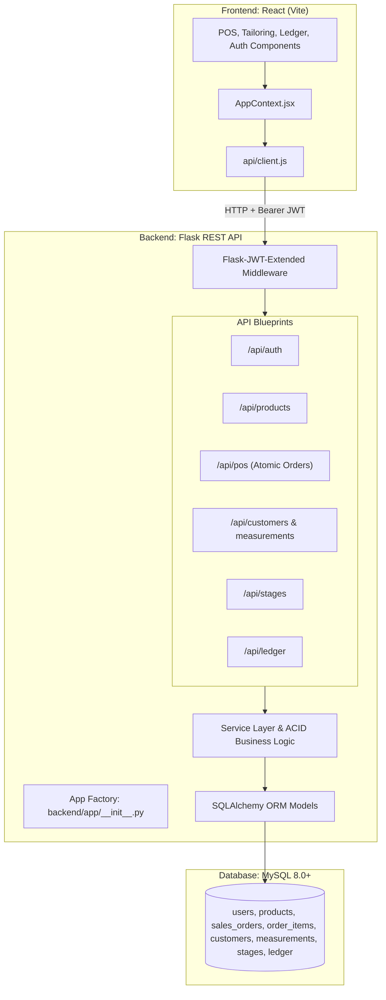

# Garment POS & ERP Platform: Flask & MySQL Integration Plan

## 1. Executive Summary & Stack Assessment

* **Architecture**: Decoupled Single Page Application (SPA) with a RESTful API and Relational Database.
* **Frontend**: React 19 (Vite)
* **Backend**: Python / Flask Application Factory
* **Database**: MySQL 8.0+
* **Authentication**: Stateless JSON Web Tokens (JWT) with Role-Based Access Control (RBAC)

### Is this combination professional?
**Yes, 100%.** 
* **React** is the enterprise standard for complex, stateful dashboards and Point of Sale (POS) interfaces.
* **Flask** is a battle-tested, lightweight Python framework (used by companies like Netflix, Uber internal tools, and Reddit) offering maximum modularity without the unnecessary monolithic overhead of Django.
* **MySQL** is a world-class, ACID-compliant relational database (used by Meta, GitHub, and Airbnb). For POS, financial ledger records, inventory management, and custom garment measurements, a relational database with foreign key constraints is essential to prevent data corruption.

---

## 2. Division of Responsibilities: Manual (You) vs. Automated (AI)

To implement this smoothly, here is the clear boundary between what you need to handle on your local machine versus what AI can do automatically:

```
┌─────────────────────────────────────────────────────────────┐
│                     USER (MANUAL TASKS)                     │
│  1. Install Python 3.10+ and MySQL Server (or Cloud DB)     │
│  2. Start MySQL service & create blank database             │
│  3. Set DB password and provide credentials in .env         │
└──────────────────────────────┬──────────────────────────────┘
                               │ Handover Credentials
                               ▼
┌─────────────────────────────────────────────────────────────┐
│                      AI (AUTOMATED TASKS)                   │
│  1. Scaffold entire Flask backend folder structure          │
│  2. Write SQLAlchemy models & relationships                 │
│  3. Setup Flask-Migrate & generate initial schema           │
│  4. Write migration script to import seedData.js into MySQL │
│  5. Build all REST API endpoints & JWT authentication       │
│  6. Implement atomic database transactions for POS sales    │
│  7. Create frontend API client & configure Vite proxy       │
│  8. Refactor AppContext.jsx to fetch/sync from API          │
│  9. Verify end-to-end integration & zero UI breakages       │
└─────────────────────────────────────────────────────────────┘
```

### What You (The User) Need to Do Manually:
1. **Install Prerequisites**:
   * Ensure Python 3.10+ is installed (`python3 --version`).
   * Ensure MySQL Server is installed (or use a free cloud MySQL instance like PlanetScale, Aiven, or Supabase).
2. **Initialize the Database**:
   * Start your local MySQL server.
   * Run one SQL command to create an empty database:
     ```sql
     CREATE DATABASE garment_erp CHARACTER SET utf8mb4 COLLATE utf8mb4_unicode_ci;
     ```
3. **Configure Environment Secrets**:
   * Set your MySQL username and password in a `backend/.env` file.

---

### What AI Can Do Automatically:
1. **Scaffold Flask Backend**: Create the complete application structure, configure CORS, and set up the application factory pattern.
2. **Generate Database Models**: Write all SQLAlchemy models matching products, variants, orders, customers, measurements, stages, employees, and ledger entries.
3. **Database Migrations & Seeding**: Generate migration scripts and write a data-seeding utility that imports all your existing `seedData.js` items directly into MySQL.
4. **Build REST API Endpoints**: Implement all CRUD endpoints, role-based decorators (`@admin_required`), and POS checkout logic with atomic rollbacks (`db.session.commit()` / `rollback()`).
5. **Frontend API Layer**: Create `src/api/client.js` with interceptors for JWT injection and automated 401 handling.
6. **Vite Proxy Configuration**: Update `vite.config.js` with proxy rules so frontend calls to `/api/*` automatically route to `localhost:5000` without CORS errors.
7. **AppContext Refactoring**: Transition `src/context/AppContext.jsx` from `localStorage` to async API synchronization while keeping all component props, function names, and state signatures identical (meaning **zero UI components need rewriting**).

---

## 3. Target System Architecture



---

## 4. Database Schema Specification (MySQL)

All financial fields use `DECIMAL(10, 2)` to eliminate floating-point rounding errors.

### 1. `users`
* `id` VARCHAR(36) PRIMARY KEY
* `username` VARCHAR(50) UNIQUE NOT NULL
* `email` VARCHAR(100) UNIQUE NOT NULL
* `password_hash` VARCHAR(255) NOT NULL
* `full_name` VARCHAR(100) NOT NULL
* `role` ENUM('admin', 'store_manager', 'tailor', 'cashier') NOT NULL
* `is_active` BOOLEAN DEFAULT TRUE
* `created_at` TIMESTAMP DEFAULT CURRENT_TIMESTAMP

### 2. `products`
* `id` VARCHAR(50) PRIMARY KEY (e.g., 'PRD-101')
* `sku` VARCHAR(50) UNIQUE NOT NULL
* `barcode` VARCHAR(50) UNIQUE INDEX
* `name` VARCHAR(255) NOT NULL
* `category` VARCHAR(100)
* `brand` VARCHAR(100)
* `fabric` VARCHAR(150)
* `cost_price` DECIMAL(10, 2) NOT NULL
* `price` DECIMAL(10, 2) NOT NULL
* `mrp` DECIMAL(10, 2) NOT NULL
* `stock` INT NOT NULL DEFAULT 0
* `min_stock` INT NOT NULL DEFAULT 5
* `sizes` JSON
* `colors` JSON
* `fit` VARCHAR(50)
* `tax_rate` DECIMAL(5, 2) DEFAULT 12.00
* `hsn` VARCHAR(20)
* `image` VARCHAR(255)

### 3. `customers` & `measurements`
* `customers`: `id`, `name`, `phone` (INDEX), `email`, `city`, `gstin`, `credit_limit`, `balance`
* `measurements`: `id`, `customer_id` (FK $\to$ customers.id), `suit_type`, `measurements_json` (JSON), `notes`, `updated_at`

### 4. `sales_orders` & `sales_order_items`
* `sales_orders`: `id`, `customer_id` (FK), `user_id` (FK to cashier/user), `subtotal`, `discount`, `tax`, `total`, `payment_method`, `created_at`
* `sales_order_items`: `id`, `order_id` (FK), `product_id` (FK), `quantity`, `unit_price`, `total_price`

### 5. `product_stages` & `order_bookings`
* Tracks custom garment manufacturing steps:
  * Cutting $\to$ Stitching $\to$ Trial $\to$ Finishing $\to$ Ready for Delivery.

### 6. `ledger_entries`
* `id`, `entry_date`, `type` (CREDIT/DEBIT), `category`, `amount`, `reference_id`, `balance_after`, `description`

---

## 5. Backend Directory Layout

```text
backend/
├── app/
│   ├── __init__.py          # Flask App Factory (register blueprints, CORS, JWT, DB)
│   ├── config.py            # Development / Testing / Production configs
│   ├── extensions.py        # db, migrate, jwt, bcrypt, cors instances
│   ├── models/              # SQLAlchemy model declarations
│   │   ├── __init__.py
│   │   ├── user.py
│   │   ├── product.py
│   │   ├── customer.py
│   │   ├── order.py
│   │   ├── stage.py
│   │   └── ledger.py
│   ├── routes/              # REST Blueprints
│   │   ├── __init__.py
│   │   ├── auth.py          # /api/auth
│   │   ├── products.py      # /api/products
│   │   ├── pos.py           # /api/pos
│   │   ├── customers.py     # /api/customers
│   │   ├── stages.py        # /api/stages
│   │   └── ledger.py        # /api/ledger
│   ├── services/            # Reusable business logic (e.g., checkout & inventory deduction)
│   │   ├── inventory_service.py
│   │   └── order_service.py
│   └── utils/
│       └── decorators.py    # Role checking decorators
├── migrations/              # Alembic schema version tracking
├── seed_db.py               # Seed script converting seedData.js to MySQL
├── .env.example             # Template for DB URI and JWT Secret
├── requirements.txt         # All backend python packages
└── run.py                   # Development entry point (python run.py)
```

---

## 6. Frontend Integration Blueprint

### Step 1: Vite Proxy Configuration (`vite.config.js`)
Enables seamless local requests without CORS issues:
```javascript
import { defineConfig } from 'vite'
import react from '@vitejs/plugin-react'

export default defineConfig({
  plugins: [react()],
  server: {
    proxy: {
      '/api': {
        target: 'http://127.0.0.1:5000',
        changeOrigin: true,
        secure: false,
      },
    },
  },
})
```

### Step 2: API Client (`src/api/client.js`)
* Automatically retrieves JWT token from `localStorage` and appends `Authorization: Bearer <token>` header.
* Dispatches error notifications on network or validation failures.

### Step 3: AppContext Transition (`src/context/AppContext.jsx`)
* **Before**: Reads synchronously from `localStorage.getItem('tc_products')`.
* **After**:
  * Initializes state as empty arrays with a `loading: true` flag.
  * In `useEffect`, calls `/api/products`, `/api/customers`, etc.
  * Preserves every existing action function signature (e.g., `addProduct(productData)`), but executes the backend POST request first and updates React state upon success.
  * UI components remain completely unaffected.

---

## 7. Step-by-Step Implementation Roadmap

1. **Step 1**: User installs Python 3.10+ and MySQL, creates the database, and provides credentials.
2. **Step 2**: AI writes `backend/requirements.txt`, application factory, and configuration.
3. **Step 3**: AI writes all SQLAlchemy models and creates the initial migration.
4. **Step 4**: AI writes and runs `seed_db.py` to populate MySQL with initial products, customers, and stages.
5. **Step 5**: AI implements all Flask Blueprints and JWT authentication.
6. **Step 6**: AI creates `src/api/client.js` and configures Vite proxy.
7. **Step 7**: AI transitions `AppContext.jsx` methods to communicate with the Flask API.
8. **Step 8**: End-to-end verification (login, inventory management, POS checkout, ledger update).
